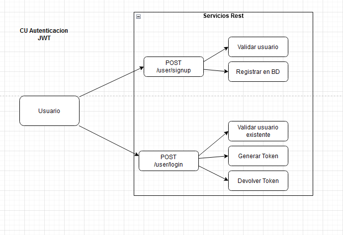
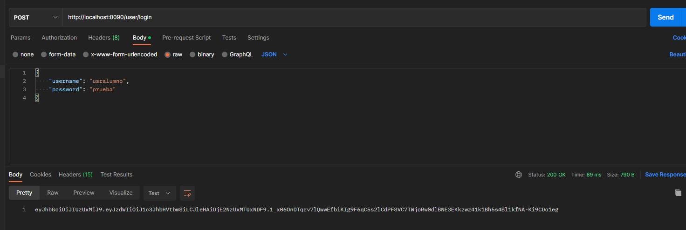
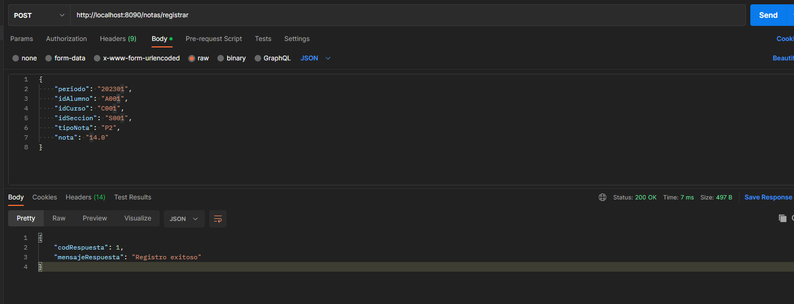
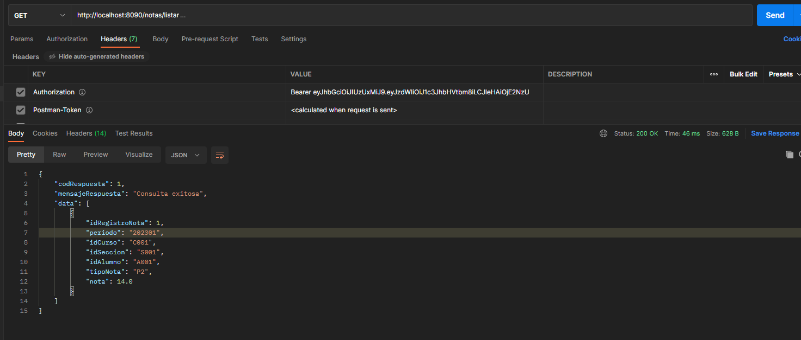

# apirest
API Rest Technical Test Backend - UTP
## Acerca de
Proyecto Maven, usando Sprint Boot y JWT
IDE: Eclipse

## Iniciar proyecto
Iniciar la aplicacion con el pluggin de maven build (`mvn spring-boot:run`).
La aplicacion se ejecuta en la siguiente url [http://localhost:8090](http://localhost:8090).
```
Paths: 
http://localhost:8090/user/signup
http://localhost:8090/user/login
http://localhost:8090/notas/registrar
http://localhost:8090/notas/listar/{idAlumno}
http://localhost:8090/notas/listar
```

Se usa la BD H2, la consola se carga en la siguiente ruta [http://localhost:8090/h2-console](http://localhost:8090/h2-console)
```
Url: jdbc:h2:mem:notasdb
Usuario : sa
Password: password
```


## Patron de diseño  - 

Se utiliza el Patron Repositoy en la capa de persistencia de modelo de dominio, para aislar el origen de datos del resto de la aplicacion.


## Modelo de BD


## SWAGGER - Documentacion de APIS
La documentacion se encuentra en la siguiente ruta:
[http://localhost:8090/swagger-ui/#/](http://localhost:8090/swagger-ui/#/)


## Caso de Usos


#### Autenticacion

La autenticacion se realiza usando JWT, generando un token que sera requerido en los demas servicios.




#### Registrar Notas

Para registrar notas  se debe generar el token y este sera enviado al servicio que validara los datos enviados, registrará la nota y devolvera el mensaje de confirmacion o de validacion.


#### Listar Notas
Para obtener las notas de un alumno se debe generar el token del usuario del alumno y este sera enviado al servicio que validara los datos enviados, obtendra el alumno relacionado al usuario y devolvera las notas o los mensajes de validacion.


 
 
 
## Screenshot evidencias

#### Registro de usuario


#### Login de usuario usralumno 
idalumno = A001


#### Registro de notas


Se registra nota para otro alumno A002


#### Consulta de notas del idAlumno A001 con el token del usuario usralumno

El usuario "usralumno", que corresponde al alumno A001 solo puede ver sus notas.


 


## Pruebas funcionales 

Se uso Cucumber con JUnit.


Se genera un reporte en la ruta: /build/reports/tests/cucumber/cucumber-report.html


## Docker

#### Build

`mvnw install dockerfile:build`

#### Mostrar docker images

`docker images`

#### Run
`docker run --name apirest -p 8090:8090 -t darkdavid/apirest`


## Docker Hub 

### Ruta de la imagen
[https://hub.docker.com/r/darkdavid/apirest](https://hub.docker.com/r/darkdavid/apirest)

### Ejecutarlo local

`docker pull darkdavid/apirest:1.0`

`docker run --name apirest -p 8090:8090 -t darkdavid/apirest:1.0`


## Author
 
**David M. Calixtro Bustamante**

